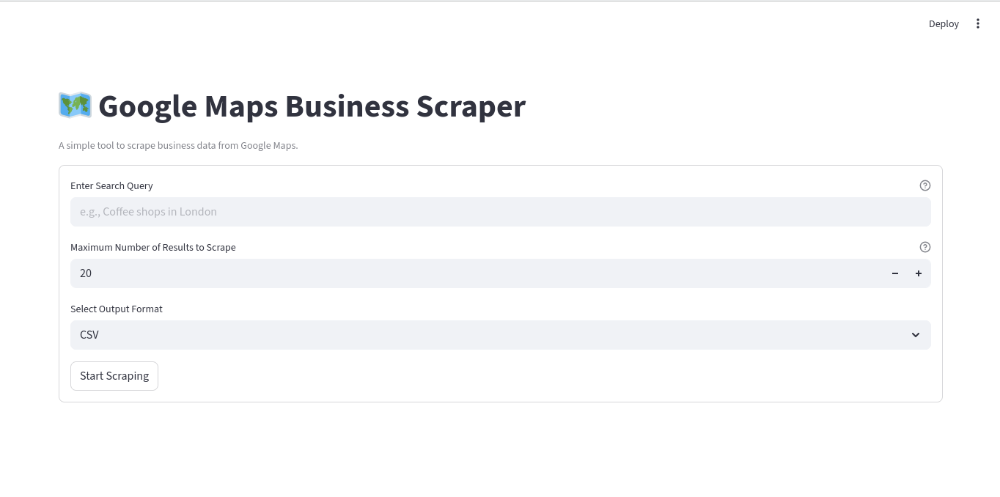
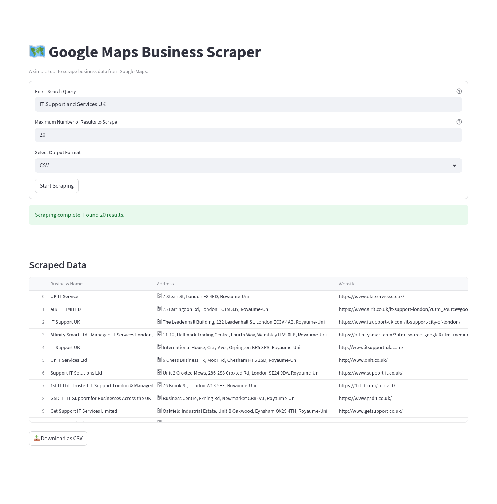

# 🗺️ Google Maps Business Scraper

A powerful and user-friendly tool for scraping business data from Google Maps. This application features a clean web interface built with Streamlit, allowing anyone to extract business names, addresses, websites, and review counts for any search query—without writing a single line of code.

The scraped data can be instantly downloaded as a CSV, Excel, or JSON file, making it perfect for lead generation, market research, competitor analysis, or data projects.

---

## ✨ Project Strengths & Key Features

This project stands out by combining powerful web scraping technology with a focus on user experience and reliability.

*   **Simple Web Interface:** No more command lines. The intuitive interface, built with Streamlit, makes the tool accessible to everyone, regardless of technical skill.
*   **Bypasses Bot Detection:** Leverages `undetected-chromedriver` to mimic human browser behavior, ensuring robust and reliable performance against Google's anti-scraping measures.
*   **Handles Modern Web Design:** Intelligently manages the "infinite scroll" feature on Google Maps, ensuring it scrapes all available results on the page.
*   **Fully Customizable Scrapes:** Users can define any search query (e.g., "IT Services in London," "Best restaurants in Paris") and set a precise limit on the number of results to collect.
*   **Multiple Export Formats:** Download your data in CSV, Excel (.xlsx), or JSON format with a single click, allowing for easy integration with spreadsheets, databases, or other applications.
*   **Cost-Effective Solution:** Operates using open-source Python libraries, providing a powerful data extraction tool without the cost of official API subscriptions.
*   **Live Progress Feedback:** The interface provides real-time status updates and a progress bar, so you always know the scraper's status.

---

## 🖥️ User Interface Overview

The application is designed for simplicity. The entire workflow is managed through a clean, single-page interface.

### Initial View
When you first launch the app, you are presented with a simple form to configure your scrape.



### Results View
After the scraping process is complete, the data is displayed in a table, with a clear download button ready.




**The user workflow is as follows:**

1.  **Enter Search Query:** A text box where you type what you want to search for.
2.  **Set Maximum Results:** A number input to specify how many business listings you want.
3.  **Select Output Format:** A dropdown menu to choose between CSV, Excel, or JSON.
4.  **Start Scraping:** A button to begin the process.
5.  **Live Progress:** A progress bar and status text will appear, showing which business is currently being scraped.
6.  **Results Preview:** The scraped data is displayed in a table directly in the app.
7.  **Download Data:** A download button appears, allowing you to save the results to your computer.

---

## 🚀 Installation and Running the Project

Follow these steps to get the project running on your local machine.

#### **Prerequisites**
*   Python 3.8 or newer.
*   Google Chrome browser installed.

#### **Step 1: Clone the Repository**
Open your terminal and clone this repository to your local machine.
```bash
git clone https://github.com/C-EB/google_maps_business_scraper.git
cd google-maps-scraper```

#### **Step 2: Create a Virtual Environment (Recommended)**
It's best practice to create a virtual environment to manage project dependencies.
```bash
# For Windows
python -m venv venv
venv\Scripts\activate

# For macOS/Linux
python3 -m venv venv
source venv/bin/activate
```

#### **Step 3: Install Dependencies**
This project requires a few libraries. You can install them all using the provided `requirements.txt` file (or create one yourself).

Create a file named `requirements.txt` with the following content:
```txt
streamlit
pandas
openpyxl
undetected-chromedriver
selenium
```
Now, install the dependencies:
```bash
pip install -r requirements.txt
```

#### **Step 4: Run the Streamlit App**
Launch the application by running the following command in your terminal:
```bash
streamlit run app.py
```
Your default web browser will automatically open a new tab with the application running.

---

## 🛠️ How It Works: Technical Overview

The project is built with a simple two-part structure: a frontend for user interaction and a backend for the heavy lifting.

*   **Frontend (`app.py`):** The user interface is built with **Streamlit**. It's responsible for capturing the user's inputs (query, max results, format), starting the scraping process, and displaying the progress and final data.

*   **Backend (`scraper.py`):** This is the core scraping engine. It uses:
    *   **Selenium:** To programmatically control a web browser.
    *   **undetected-chromedriver:** A special version of the Chrome driver that avoids being flagged as a bot, making the scraping process more reliable.

*   **The Process:**
    1.  The Streamlit app (`app.py`) calls the `scrape_google_maps` function from the `scraper.py` file.
    2.  The backend launches a headless Chrome browser, navigates to Google Maps, and enters the search query.
    3.  It then repeatedly scrolls down the results panel to trigger the "infinite scroll" and load all business listings.
    4.  For each business found, it opens the listing in a new tab, extracts the required data (name, address, etc.), and closes the tab.
    5.  A special `progress_callback` function is used to send live status updates from the backend scraper back to the frontend UI.
    6.  Once the process is complete, the data is returned to the Streamlit app, which displays it and makes it available for download.

---

## 🤝 Contributing

Contributions are welcome! If you have ideas for new features, find a bug, or want to improve the code, please feel free to:
1.  Open an issue to discuss the change.
2.  Fork the repository and submit a pull request.
